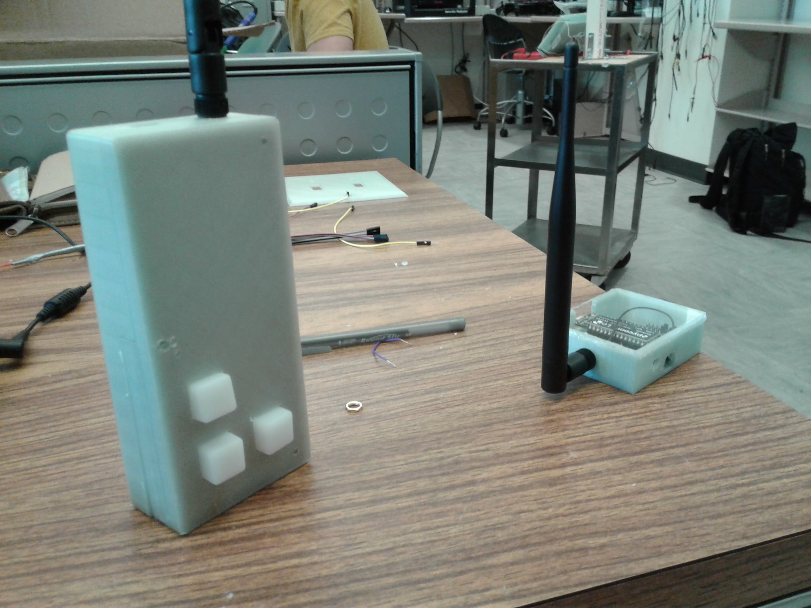
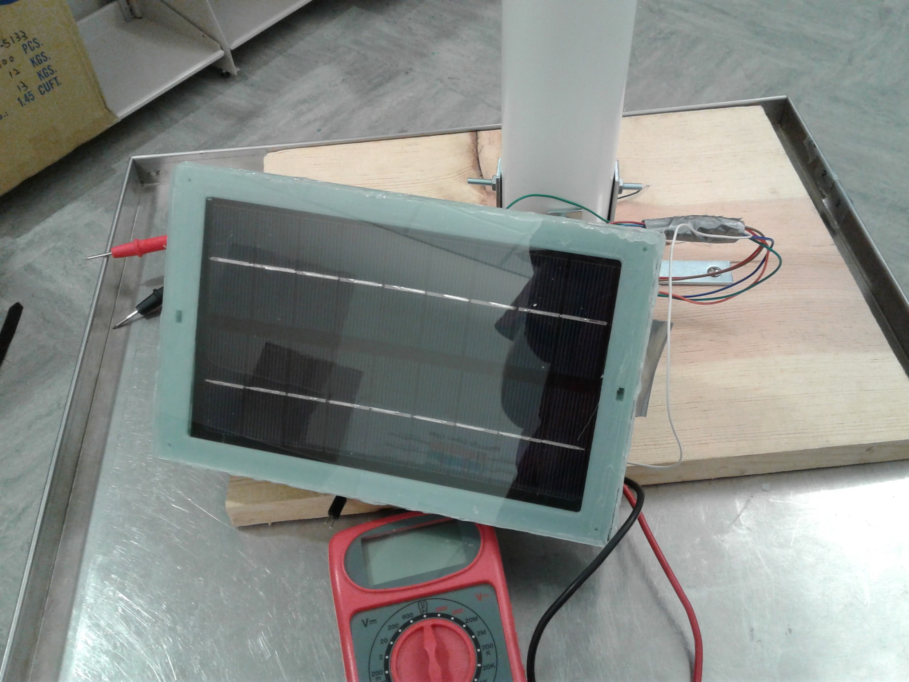
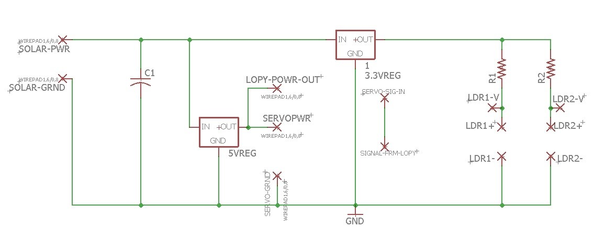
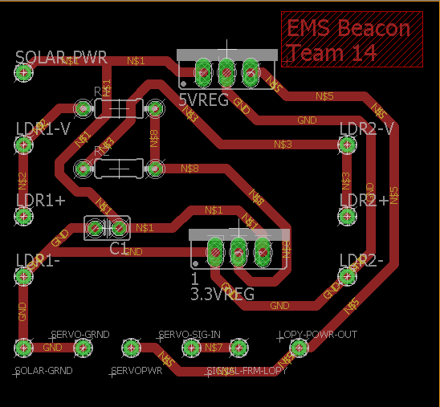
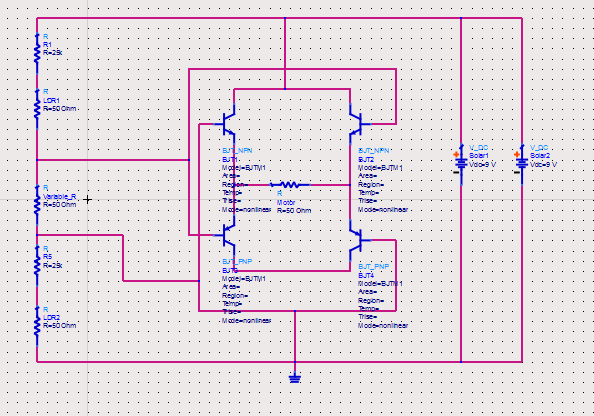

# Pycom LoRa Beacon and Nano-Gateway

* Refer to the [pycom documentation](https://docs.pycom.io/) for initial setup of your pycom devices*

This repository includes all the MicroPython libraries necessary to setup a beacon and nano-gateway using Pycom LoPy devices.

Once you have registered your devices on [The Things Network](https://www.thethingsnetwork.org/), you can easily setup your devices to forward code from `Beacon -> Gateway -> The Things Network`!

## The Hardware
We used a few not so necessary items for our specific project. Anything not required is denoted with a `*`
- 2 x Pycom LoPy
- 9V 3W Mini Solar Panel *
- Pycom Pytrack Expansion Board *
- Pycom Expansion Board
- 1250 mAh+ 7.4 V LiPo Battery (You can simply power everything with USB)
- Servos for moving the solar panel *
- Custom 3D printed cases for the beacon, gateway and solar panel *

There are a few extra libraries and sample code in the `main.py` file for messing around. If you don't have the Pytrack, you can remove any code which it uses.

## The Devices

These are the final products all assembled and connected.

## Schematics

The following schematics are for the solar tracking panel and the voltage regulator. The voltage regulator must be used since the LoPy device requires ~5V to run and the solar panel 

